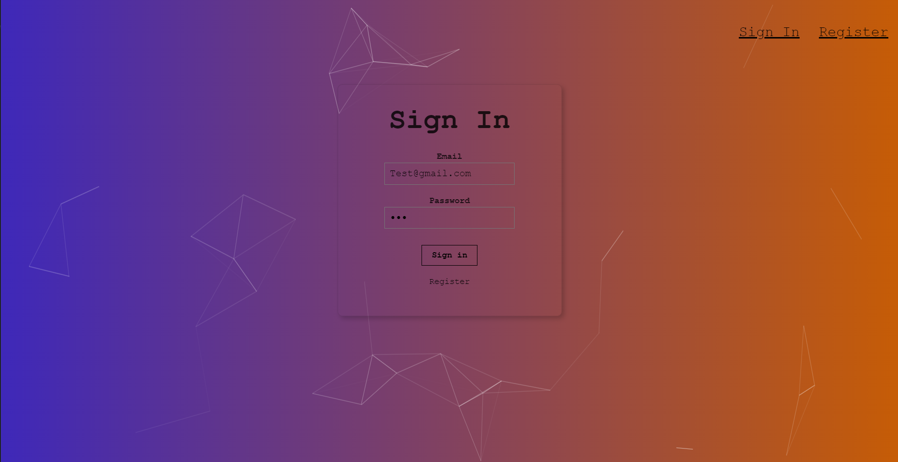
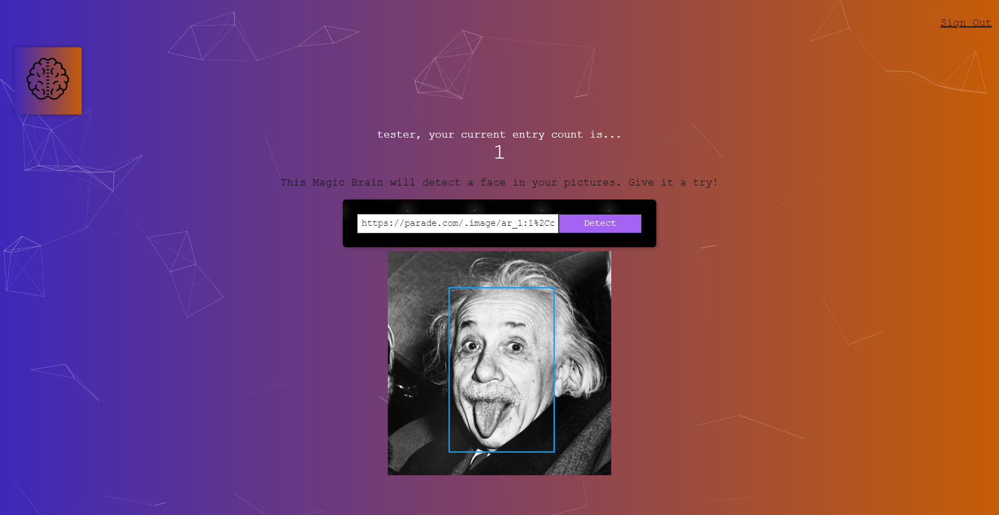

SmartBrain is a web application which uses ReactJs in the front end, Node.JS, Express.JS and PostgreSQL for its server and database respectively and detect faces in an image using an image recognition API.

To give you a flavor of the app, here is a screenshot of home page:

Visit [live site](https://smart-brain-420.herokuapp.com/) 

For a demo use the credentials below else you can always register yourself
 
Test email - tester@gmail.com
Test password - test1234
 
[Example image](https://parade.com/.image/ar_1:1%2Cc_fill%2Ccs_srgb%2Cfl_progressive%2Cq_auto:good%2Cw_1200/MTkwNTgwOTUyNjU2Mzg5MjQ1/albert-einstein-quotes-jpg.jpg)